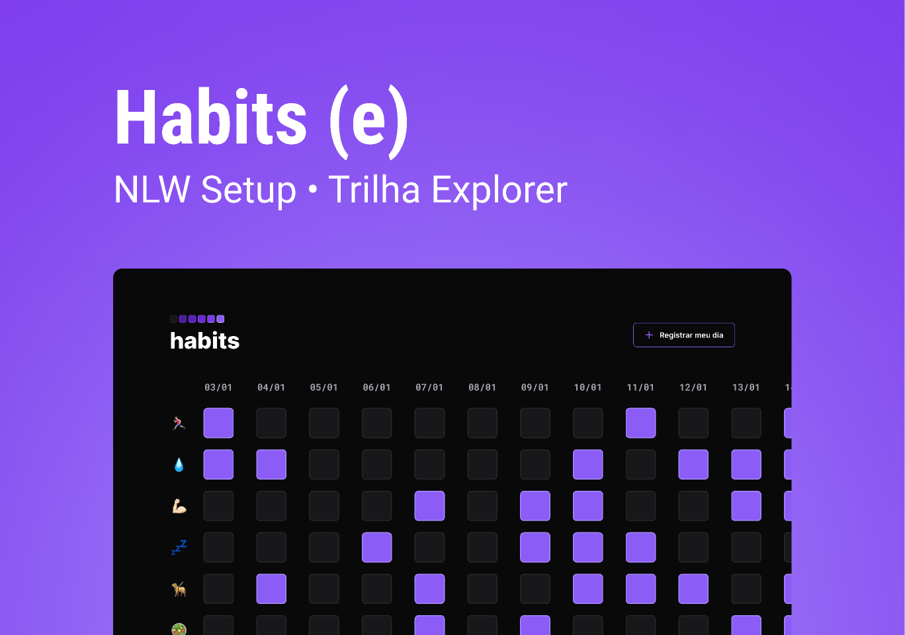

<h1 align="center">Habits</h1>

NLW é um evento exclusivo e gratuito, promovido pela Rocketseat tecnologias Web.  

<a href="#-tecnologias">Tecnlogias</a>
<a href="#-projeto">Projeto</a>
<a href="#-layout">Layout</a>
<a href="#MIT-licença">Lincença</a>

 

## 💻TECNOLOGIAS

Esse projeto foi desenvolvido com as seguintes tecnologias:
- HTML e CSS
- JavaScript
- Git e GitHub
- Figma

# 🧛‍♀️Project

O habits é um app para ajudar a rastrear os hábitos.

## :memo: Lincença

Esse projeto está sob a licença MIT.

Feito com 🤍 by RocketSeat :wave: [participe da comunidade!](https://discord.gg/rocketseat)